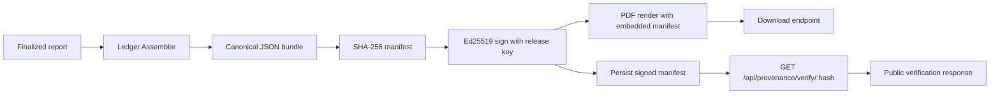
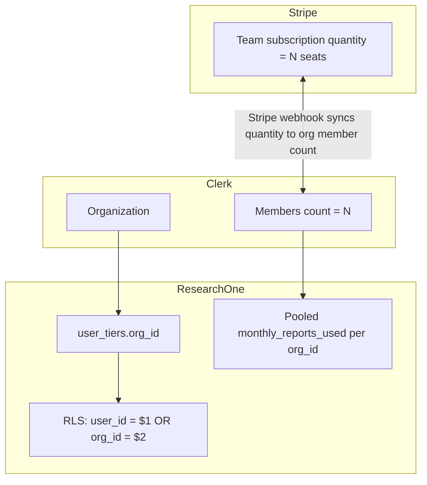

# Phase 2 — Deferred Features

Two product features were intentionally deferred from the Phase 1 launch
because each is a multi-day effort that touches cross-cutting concerns
(billing, auth, RLS, frontend, signing infrastructure) and shipping them
half-baked would create the kind of customer-support bugs that happen at
11 PM on a Saturday.

Both features are surfaced on the live pricing page today as
**"Coming soon — Contact us"** so revenue intent is captured even before
the self-serve path lights up.

---

## 1. Provenance Ledger (WO-O follow-up)

### Customer purpose

ResearchOne's core value proposition is **defensible, auditable research
output**. The customers who pay for this — investigative journalists who
defend claims against legal challenge, patent counsel building prior-art
evidence chains, diligence analysts whose clients sue when reports turn
out wrong, sovereign / defense-adjacent buyers under audit obligations,
policy / think-tank shops where citation provenance is the whole product
— don't trust "the AI said so." They need to prove **how** a report was
produced and that **nothing was tampered with** between generation and
delivery.

The Provenance Ledger is what makes that proof possible. It is the
feature that lets ResearchOne charge Pro / Team / Sovereign prices for
outputs that competitors (Perplexity, ChatGPT, Elicit) cannot match,
because none of them produce a tamper-evident audit trail of the
reasoning process itself.

### What it does

For any finalized report, the Provenance Ledger:

1. **Bundles** the full research record:
   - `research_runs` row (run config, model ensemble used, mode, who ran it, when)
   - `discovery_events` (every external source found, with retrieval timestamp and provider)
   - `claims` (every claim made, with evidence tier and source pointer)
   - `contradictions` (every contradiction surfaced — preserved, not smoothed)
   - `report_citations` (the final citation graph)
2. **Generates a tamper-evident artifact**:
   - SHA-256 hash of the canonical bundle
   - Signed by a ResearchOne release key
   - Timestamped
3. **Exposes a public verification endpoint** — `GET /api/provenance/verify/:manifestHash` —
   that anyone (including a litigant or auditor with no ResearchOne account)
   can hit to confirm the manifest is genuine and unmodified.

### Scope of work

| Component | Effort |
|---|---|
| `backend/src/services/provenance/ledgerAssembler.ts` — pulls the 5 tables, canonicalizes JSON | Small |
| `backend/src/services/provenance/manifestSigner.ts` — Ed25519 (or RSA) signing, deterministic canonicalization | Small-medium |
| Key management — release public key checked into repo, private key in env / KMS, rotation policy | Medium |
| `backend/src/services/provenance/ledgerExporter.ts` — PDF generation (likely `pdfkit` or `puppeteer`) | Medium |
| `GET /api/provenance/verify/:manifestHash` — public route, no auth, returns valid/invalid + canonical bundle hash | Small |
| `manifest_storage` table or object-store path — manifests stay verifiable after the run row is deleted | Small |
| Frontend: download button on finalized reports, verify-this-report public page | Small |
| Tests: tamper detection, signature roundtrip, bundle determinism | Medium |
| Doc: how to verify a ResearchOne report (public-facing) | Small |

### Phase 1 placeholder

- Pricing page lists Provenance Ledger with "Coming soon — Enterprise" badge
- CTA opens a `mailto:hello@researchone.io?subject=Provenance%20Ledger%20enterprise%20inquiry`
- No backend stub — everything is server-side once the WO lands

### MVP scope option (if scope-down is desired)

If a same-day MVP is needed before the full implementation:

- Signed JSON bundle (no PDF), in-app download, verify endpoint
- Skips PDF rendering and the public verify landing page
- Enterprise customers can verify with `curl + jq + openssl`

---

## 2. Multi-seat Team management (WO-G / Q follow-up)

### Customer purpose

The Team tier ($99/seat/mo, 3-seat minimum) targets small analyst teams:
3–12 person boutique funds, IP/patent shops, journalism teams, policy /
think-tank shops. The pricing page promises:

- Pooled report quota (80 reports/seat × 3 seats = 240 pooled/month)
- Shared corpus across the team
- Audit log
- SSO via Clerk

These promises are visible on the pricing page today, but the backend
currently treats every Team subscription as `quantity: 1`. Anyone who
tries to buy "Team for 4 seats" today would get a single-seat
subscription with no way to invite the other 3 people.

To avoid shipping that broken path, the Team tile uses a "Contact us"
mailto CTA for Phase 1 launch.

### What it needs to do

The team-management feature has four moving parts that all have to agree:

| Capability | What it means |
|---|---|
| Org creation | Team purchaser creates a Clerk organization at checkout time |
| Member invite | Org admin sends invite; invitee accepts; their `user_tiers.org_id` gets set |
| Stripe quantity sync | Org member count change → webhook updates `subscription.items[0].quantity` so billing matches headcount |
| Pooled quota | Monthly report count rolls up to `org_id`, not `user_id` (so one heavy user doesn't cap out the team) |
| Shared corpus / RLS | RLS predicate already supports `user_id = $1 OR org_id = $2` for `user_tiers`. Need to extend to corpus / reports tables |
| Member management UI | List members, invite by email, remove member, transfer admin |
| Audit log | Every member add/remove writes a row; org admin can view |

### Scope of work

| Component | Effort |
|---|---|
| Clerk org integration — webhook handlers for `organization.created`, `organizationMembership.created/deleted` | Medium |
| `backend/src/services/billing/teamSeatSync.ts` — keep Stripe `quantity` matched to Clerk member count | Medium |
| Pooled quota — `incrementReportCount` and `enforceQuota` keyed on `org_id` when present | Small-medium |
| RLS policy extension on `reports` and `corpus_*` tables for `org_id` access | Small |
| Frontend: org creation flow at checkout, member list page, invite form | Medium |
| Stripe checkout — accept quantity at checkout, prorate seat additions mid-period | Medium |
| Tests: 9-tier matrix + pooled quota enforcement, Stripe quantity sync, RLS isolation between orgs | Medium |
| Doc: team admin guide | Small |

### Phase 1 placeholder

- Pricing page lists Team tier with "Coming soon" badge
- CTA opens a `mailto:hello@researchone.io?subject=Team%20tier%20inquiry`
- Single-seat Team checkout could technically work today, but is not
  wired into the marketing surface to avoid customer confusion

### MVP scope option (if scope-down is desired)

If a same-day MVP is needed before the full implementation:

- Stripe `quantity` accepted at checkout (3+)
- Clerk org auto-created at checkout
- `user_tiers.org_id` populated via webhook
- Pooled quota by `org_id`
- Basic member list and invite endpoints

Defer in MVP: SSO, audit log UI, mid-period prorating, transfer admin,
advanced RLS on corpus tables.

---

## Why these two are deferred together

Both features:

- Touch billing + auth + RLS at the same time
- Have cross-system invariants that, if violated, create customer-impact
  bugs (orphaned monitor subs, double-charges, lost access)
- Need a focused work order with proper testing, not bundled into a
  general-purpose release

The Phase 1 launch ships every other product surface fully working:
self-serve checkout for Free Demo / Student / Pro / BYOK, wallet
top-ups, Living Report and Reverse-Citation Watch add-ons (with the
add-on/tier dependency invariant correctly enforced), and the full
research/reports/monitors/billing app shell. Phase 2 adds these two
revenue-grade features.
