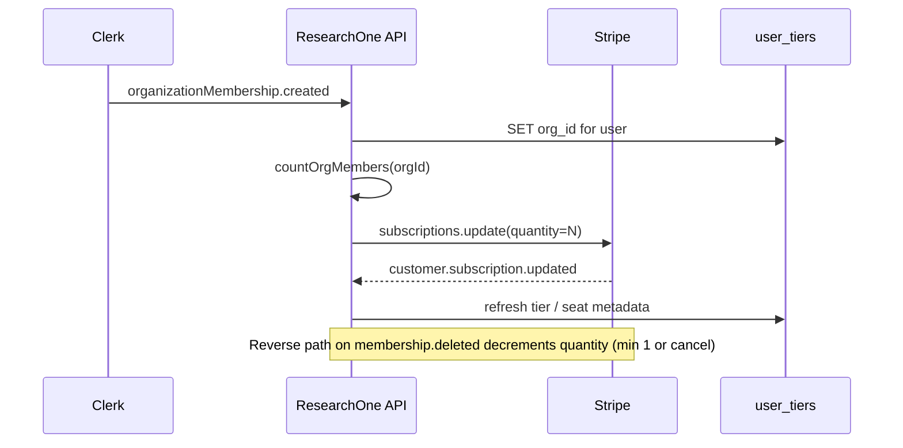

# Team tier — Phase 2 planning (WO only)

**Status:** Planning document only — **no implementation** in this work
order. Full product context lives in
`docs/roadmap/phase-2-deferred-features.md` §2.

## Goal

Ship self-serve **Team** tier: multi-seat Clerk organizations, Stripe
subscription quantity synced to member count, and **pooled** monthly
research quota at the org level (not per user).

## MVP scope (minimum shippable)

1. **Checkout** — Team purchaser selects seat count (minimum 3); Stripe
   Checkout Session uses Team price ID with `quantity = N`.
2. **Clerk org** — Organization created at checkout completion (or first
   login after subscribe); purchaser is org admin.
3. **`user_tiers.org_id`** — Populated for every org member via Clerk
   webhook handlers (`organizationMembership.created` / `deleted`).
4. **Pooled quota** — `checkTierAccess`, `incrementReportCount`, and
   `enforceQuota` roll up `monthly_reports` / `monthly_deep_reports` by
   `org_id` when present on the member's tier row.
5. **Basic member API** — List members, invite by email (Clerk invite),
   remove member (admin only).
6. **RLS** — Existing `user_id = $1 OR org_id = $2` on tier-scoped reads;
   extend to `reports` and shared corpus tables per Phase 2 scope doc.

### MVP deferrals

- SSO / SAML
- Audit log UI (write rows only, or skip until Phase 2 full)
- Mid-period seat proration (block adds or bill next period only)
- Transfer org ownership
- Advanced corpus sharing rules beyond org_id RLS

## Clerk org webhooks (canonical writers)

Mount handlers on existing `/api/webhooks/clerk` router or a dedicated
org sync module — **single writer** for `user_tiers.org_id`:

| Clerk event | Action |
|-------------|--------|
| `organization.created` | Optional: link Stripe customer metadata |
| `organizationMembership.created` | Set `user_tiers.org_id`, ensure tier row |
| `organizationMembership.deleted` | Clear `org_id`, downgrade to personal tier rules |
| `organization.deleted` | Cascade: clear org_id for all members; cancel Team sub |

Deploy-skew: tolerate missing `org_id` column until migration applies
(Rule 13).

## `teamSeatSync` sequence

New service: `backend/src/services/billing/teamSeatSync.ts` (planned).

### Invariants

1. **Stripe quantity = billable seats** — Active Clerk memberships
   (excluding pending invites) unless contract says otherwise.
2. **Never double-charge on webhook replay** — Idempotency on Clerk
   event id (same pattern as Stripe webhook ledger).
3. **Admin remove** — Removing last admin blocked; require transfer first
   (Phase 2 full).
4. **Quota pool** — One counter per `org_id` in `user_tiers` or dedicated
   `org_usage` table; document choice in implementation PR.

## Frontend (MVP)

- Team checkout path on Billing (seat stepper).
- `/app/settings/team` — member list, invite form (Clerk components or
  custom API).
- Pricing page: replace "Coming soon" when MVP lands (Rule 29 deferred
  features check).

## Testing matrix (implementation gate)

- 9-tier matrix with org member on Team vs personal Pro.
- Pooled quota: user A exhausts org pool → user B blocked until reset.
- Stripe quantity sync after invite accept and member remove.
- RLS: org A cannot read org B reports.

## Related files (today)

- RLS predicate pattern: migration 029 + `user_tiers.org_id`
- Stripe Team price IDs: `config.stripe.priceIds.teamSeatMonthly` /
  `teamSeatAnnual`
- Phase 1 placeholder: pricing "Coming soon" mailto

## Implementation PR train (suggested)

1. Migration: `org_id` indexes, optional `org_usage` rollup table.
2. Clerk webhook writers + `teamSeatSync.ts`.
3. Quota rollup in tier service.
4. Billing checkout quantity + frontend team settings.
5. Docs + runbook for team admin.
